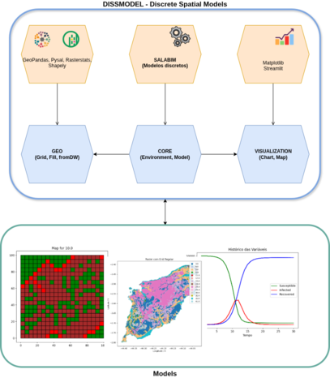
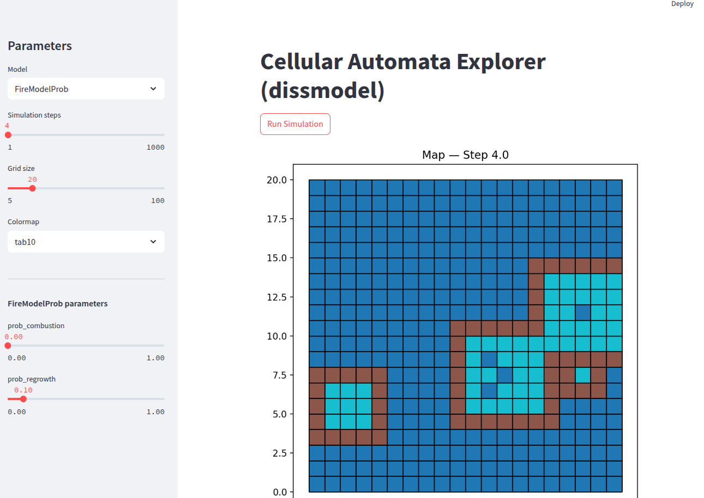

# DisSModel

**Discrete Spatial Modeling framework for Python**


[](https://opensource.org/licenses/MIT)
[](https://www.python.org/)
[](https://pypi.org/project/dissmodel/)
[](https://joss.theoj.org/papers/46522bc30d2dbec6b509d2dc487170ec)

DisSModel is a modular, open-source Python framework for spatially explicit dynamic modeling. Developed by the [LambdaGeo](https://github.com/LambdaGeo) group at the Federal University of Maranhão (UFMA), it provides a unified environment for building **Cellular Automata (CA)** and **System Dynamics (SysDyn)** models on top of the Python geospatial ecosystem.

> DisSModel is designed as a modern, Pythonic alternative to the TerraME framework, replacing the TerraLib/Lua stack with GeoPandas, PySAL, and Salabim.

---

## Features

- **Cellular Automata** — spatial grid models with configurable neighborhood strategies (Queen, Rook, KNN)
- **System Dynamics** — compartmental models with automatic live plotting via `@track_plot`
- **Flexible grid generation** — from dimensions, bounds, or an existing GeoDataFrame
- **Fill strategies** — random sampling, zonal statistics, minimum distance, and pattern-based initialization
- **Three execution modes** — CLI scripts, Jupyter notebooks, and Streamlit web apps
- **Reactive UI** — `display_inputs` reads annotated model attributes and generates sidebar widgets automatically
- **Built on standard tools** — GeoPandas, libpysal, Salabim, Matplotlib, Streamlit

---

## Installation

```bash
pip install dissmodel
```

Requires Python 3.10+.

---

## Quickstart

### System Dynamics — SIR Model

```python
from dissmodel.core import Environment
from dissmodel.models.sysdyn import SIR
from dissmodel.visualization import Chart

env = Environment()
SIR(susceptible=9998, infected=2, recovered=0, duration=2, contacts=6, probability=0.25)
Chart(show_legend=True)
env.run(30)
```

### Cellular Automaton — Forest Fire

```python
from dissmodel.core import Environment
from dissmodel.geo import regular_grid
from dissmodel.models.ca import FireModel
from dissmodel.models.ca.fire_model import FireState

gdf = regular_grid(dimension=(30, 30), resolution=1, attrs={"state": FireState.FOREST})
env = Environment(end_time=20)
fire = FireModel(gdf=gdf)
fire.initialize()
env.run()
```

### Streamlit App

```bash
streamlit run examples/streamlit/ca_all.py
```

---

## Instantiation order

The `Environment` must always be created **before** any model.
Models connect to the active environment automatically on creation.

```
Environment  →  Model  →  Visualization
     ↑             ↑            ↑
  first         second        third
```

---

## Architecture

DisSModel is organized into four modules:



| Module | Description |
|:---|:---|
| `dissmodel.core` | Simulation clock and execution lifecycle (`Environment`, `Model`) |
| `dissmodel.geo` | Spatial data structures — grid generation, fill strategies, neighborhood |
| `dissmodel.models` | Ready-to-use CA and SysDyn reference implementations |
| `dissmodel.visualization` | Observer-based visualization — `Chart`, `Map`, `display_inputs`, `@track_plot` |

---

## Included Models

### Cellular Automata (`dissmodel.models.ca`)

| Model | Description |
|:---|:---|
| `GameOfLife` | Conway's Game of Life with classic built-in patterns |
| `FireModel` | Forest fire spread with Rook neighborhood |
| `FireModelProb` | Probabilistic fire with spontaneous combustion and regrowth |
| `Snow` | Snowfall and accumulation from top row |
| `Growth` | Stochastic radial growth from a center seed |
| `Propagation` | Active state transmission with KNN neighborhood |
| `Anneal` | Binary system relaxation via majority-vote rule |

### System Dynamics (`dissmodel.models.sysdyn`)

| Model | Description |
|:---|:---|
| `SIR` | Susceptible–Infected–Recovered epidemiological model |
| `PredatorPrey` | Lotka–Volterra ecological dynamics |
| `PopulationGrowth` | Exponential growth with variable rate |
| `Lorenz` | Deterministic chaos — Lorenz attractor |
| `Coffee` | Newton's Law of Cooling |

---

## Execution Modes

All models can be run in three modes:

**CLI**
```bash
python examples/cli/sysdyn_sir.py
python examples/cli/ca_game_of_life.py
```

**Streamlit**
```bash
streamlit run examples/streamlit/sysdyn_all.py   # all SysDyn models
streamlit run examples/streamlit/ca_all.py        # all CA models
```

Running examples/streamlit/ca_all.py  ...



**Jupyter Notebook**

See [`examples/notebooks/`](examples/notebooks/) for interactive notebooks with step-by-step explanations.

---

## Reactive Streamlit Interface

`display_inputs` reads annotated model attributes and generates sidebar widgets automatically — no extra configuration needed:

```python
env = Environment(start_time=0, end_time=steps)
gdf = regular_grid(dimension=(grid_size, grid_size), resolution=1, attrs={"state": 0})
model = FireModel(gdf=gdf)
display_inputs(model, st.sidebar)  # generates sliders from type annotations
model.initialize()                 # uses parameters set by display_inputs
```

---

## Grid and Neighborhood

```python
from dissmodel.geo import regular_grid, fill, FillStrategy

# Create a 20x20 grid
gdf = regular_grid(dimension=(20, 20), resolution=1.0, attrs={"state": 0})

# Fill with random values
fill(FillStrategy.RANDOM_SAMPLE, gdf=gdf, attr="state", data={0: 0.7, 1: 0.3}, seed=42)
```

Supported neighborhood strategies: `Queen`, `Rook`, `KNN` (via libpysal).

---

## Development

```bash
git clone https://github.com/LambdaGeo/dissmodel
cd dissmodel
pip install -e .
pip install -r requirements.txt  # dev dependencies
pytest tests/
```

---

## Version 0.2.0

Major improvements:

- New raster backend architecture
- Examples for raster and vector simulations
- Improved modular structure

## Documentation

Full documentation available at: [https://lambdageo.github.io/dissmodel/](https://lambdageo.github.io/dissmodel/)

---

## Citation

If you use DisSModel in your research, please cite:

```
Costa, S. & Santos Junior, N. (2025). DisSModel: A Discrete Spatial Modeling
Framework for Python. LambdaGeo, Federal University of Maranhão (UFMA).
https://github.com/LambdaGeo/dissmodel
```

---

## License

MIT © [LambdaGeo — UFMA](https://github.com/LambdaGeo)
