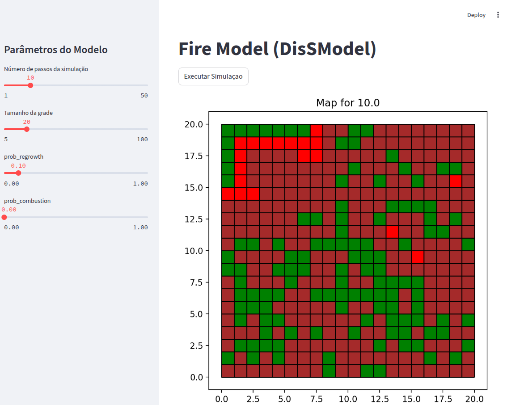

## 🔥 Exemplo 2: Modelo de Queimada (FireModelProb)

Este modelo simula a propagação de fogo em uma floresta com regras probabilísticas:

- Uma célula em estado **floresta** pode:
    - Queimar se um vizinho estiver queimando.
    - Pegar fogo com uma pequena chance aleatória (combustão espontânea).
- Uma célula **queimando** vira **queimada**.
- Uma célula **queimada** pode voltar a ser floresta com chance de **regeneração**.

### Estados

```python
FOREST = 0      # Verde
BURNING = 1     # Vermelho
BURNED = 2      # Marrom
```

### Regra de transição

```python
def rule(self, idx):
    state = self.gdf.loc[idx].state
    if state == FOREST:
        neighs = self.neighborhood.neighs(idx)
        if (neighs.state == BURNING).any():
            return BURNING
        return BURNING if random.random() < self.prob_combustion else FOREST
    elif state == BURNING:
        return BURNED
    else:
        return FOREST if random.random() < self.prob_regrowth else BURNED
```

### Variação: Estratégias de Vizinhança

Você pode trocar o tipo de vizinhança com um único parâmetro:

```python
self.neighborhood = Neighborhood(Rook, gdf, use_index=True)
```

Ou usar **KNN (K-Nearest Neighbors)**:

```python
from libpysal.weights import KNN
neigh = Neighborhood(KNN, gdf, k=4, use_index=True)
```

#### 📷 Exemplo de execução



---

### 💻 Código completo (FireModelProb)

```python
from dissmodel.core import Model, Environment
from dissmodel.geo.regular_grid import regular_grid
from dissmodel.geo.fill import fill
from dissmodel.visualization import Map
from dissmodel.visualization.streamlit import display_inputs
from matplotlib.colors import ListedColormap
import streamlit as st
import random
from dissmodel.geo.neihborhood import Neighborhood
from libpysal.weights.contiguity import Queen

class FireModelProb(Model):
    FOREST = 0
    BURNING = 1
    BURNED = 2

    def __init__(self, gdf, prob_combustion=0.001, prob_regrowth=0.1, *args, **kwargs):
        super().__init__(*args, **kwargs)
        self.prob_combustion = prob_combustion
        self.prob_regrowth = prob_regrowth
        self.gdf = gdf
        self.neighborhood = Neighborhood(Queen, gdf, use_index=True)

    def rule(self, idx):
        state = self.gdf.loc[idx].state
        if state == FireModelProb.FOREST:
            neighs = self.neighborhood.neighs(idx)
            if (neighs.state == FireModelProb.BURNING).any():
                return FireModelProb.BURNING
            else:
                return FireModelProb.BURNING if random.random() <= self.prob_combustion else FireModelProb.FOREST
        elif state == FireModelProb.BURNING:
            return FireModelProb.BURNED
        else:
            return FireModelProb.FOREST if random.random() <= self.prob_regrowth else FireModelProb.BURNED

    def execute(self):
        self.gdf["state"] = self.gdf.index.map(self.rule)

st.set_page_config(page_title="Fire Model", layout="centered")
st.title("Fire Model (DisSModel)")

st.sidebar.title("Parâmetros do Modelo")
steps = st.sidebar.slider("Número de passos da simulação", min_value=1, max_value=50, value=10)
grid_dim = st.sidebar.slider("Tamanho da grade", min_value=5, max_value=100, value=20)
executar = st.button("Executar Simulação")

gdf = regular_grid(dimension=(grid_dim, grid_dim), resolution=1, attrs={'state': 0})
env = Environment(end_time=steps, start_time=0)
fire = FireModelProb(gdf=gdf)
display_inputs(fire, st.sidebar)

plot_area = st.empty()
custom_cmap = ListedColormap(['green', 'red', 'brown'])
plot_params = {"column": "state", "cmap": custom_cmap, "ec": "black"}

Map(gdf=gdf, plot_area=plot_area, plot_params=plot_params)

if executar:
    env.run()
```

