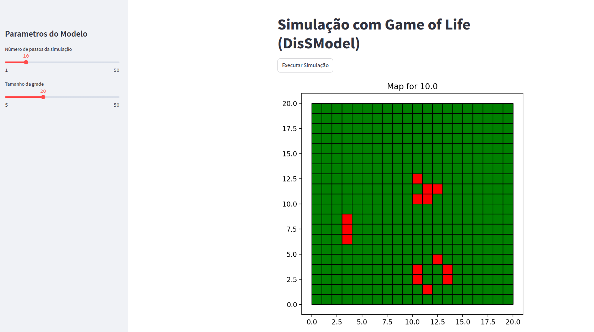

## 🔲 Exemplo 1: Game of Life (Jogo da Vida)

O **Game of Life**, criado por John Conway, é um autômato celular clássico com regras simples:

- Uma célula **viva** permanece viva com 2 ou 3 vizinhos vivos.
- Uma célula **morta** revive com exatamente 3 vizinhos vivos.

### 🧩 Componentes do Modelo

- A grade é inicializada com padrões (ex: `glider`, `toad`, etc.), usando `fill(..., strategy=FillStrategy.PATTERN)`.
- A vizinhança usada é a **Queen**, que considera os 8 vizinhos ao redor.
- A regra de atualização verifica o número de vizinhos vivos para decidir o próximo estado.

```python
class GameOfLife(Model):
    def rule(self, idx):
        value = self.gdf.loc[idx].state
        count = self.neighborhood.neighs(idx)["state"].fillna(0).sum()
        if value == 1:
            return 1 if count in [2, 3] else 0
        else:
            return 1 if count == 3 else 0
```

### 🖼️ Visualização

A visualização utiliza `Map(...)` com colormap personalizado:

- Células **vivas** em vermelho (`state = 1`)
- Células **mortas** em verde (`state = 0`)
- Interface interativa com `Streamlit` para ajustar tamanho da grade e passos da simulação.

#### 📷 Exemplo de execução



---

### 💻 Código completo (Game of Life)

```python
from dissmodel.core import Model, Environment
from dissmodel.geo import regular_grid, fill, FillStrategy, Neighborhood
from dissmodel.visualization.map import Map
from matplotlib.colors import ListedColormap
import streamlit as st
import random
from libpysal.weights.contiguity import Queen

class GameOfLife(Model):
    patterns = {
        "glider": [
            [0, 1, 0],
            [0, 0, 1],
            [1, 1, 1]
        ],
        "toad": [
            [0, 1, 1, 1],
            [1, 1, 1, 0]
        ],
        "blinker": [
            [1, 1, 1]
        ]
    }

    def setup(self, gdf):
        self.gdf = gdf
        self.neighborhood = Neighborhood(Queen, gdf, use_index=True)   

    def rule(self, idx):
        value = self.gdf.loc[idx].state
        neighs = self.neighborhood.neighs(idx)
        count = neighs["state"].fillna(0).sum()
        if value == 1:
            return 1 if count in [2, 3] else 0
        else:
            return 1 if count == 3 else 0

    def execute(self):
        self.gdf["state"] = self.gdf.index.map(self.rule)
        print(self.env.now())

st.set_page_config(page_title="Modelo Game of Life", layout="centered")
st.title("Simulação com Game of Life (DisSModel)")

st.sidebar.title("Parâmetros do Modelo")
steps = st.sidebar.slider("Número de passos da simulação", min_value=1, max_value=50, value=10)
grid_dim = st.sidebar.slider("Tamanho da grade", min_value=5, max_value=50, value=20)

custom_cmap = ListedColormap(['green', 'red'])
plot_params = { "column": "state", "cmap": custom_cmap, "ec": 'black' }

grid = regular_grid(dimension=(grid_dim, grid_dim), resolution=1, attrs={'state': 0})

for name, pattern in GameOfLife.patterns.items():
    start_x = random.randint(0, grid_dim - 5)
    start_y = random.randint(0, grid_dim - 5)
    fill(strategy=FillStrategy.PATTERN, gdf=grid, attr="state", pattern=pattern, start_x=start_x, start_y=start_y)

env = Environment(end_time=steps, start_time=0)
GameOfLife(gdf=grid)

if st.button("Executar Simulação"):
    plot_area = st.empty()
    Map(gdf=grid, plot_area=plot_area, plot_params=plot_params)
    env.run()
```
