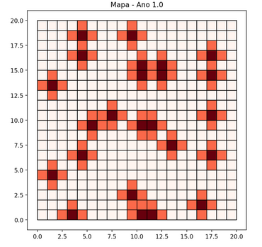
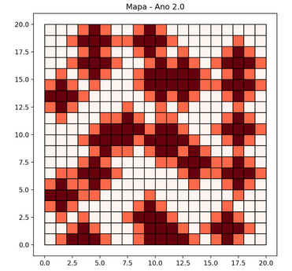
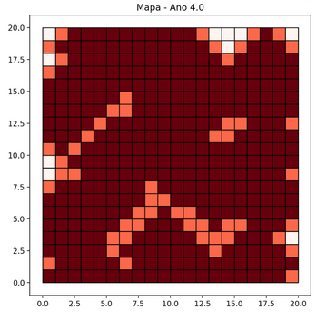

# Fire Model

A deterministic forest fire spread model implemented on a regular GeoDataFrame grid.





## Usage

```python
from matplotlib.colors import ListedColormap

from dissmodel.core import Environment
from dissmodel.geo import vector_grid
from dissmodel.models.ca import FireModel
from dissmodel.models.ca.fire_model import FireState
from dissmodel.visualization.map import Map

gdf = vector_grid(dimension=(30, 30), resolution=1, attrs={"state": FireState.FOREST})

env = Environment(end_time=20)
fire = FireModel(gdf=gdf)
fire.initialize()

Map(
    gdf=gdf,
    plot_params={
        "column": "state",
        "cmap": ListedColormap(["green", "red", "gray"]),  # FOREST, FIRE, ASH
        "ec": "gray",
    },
)

env.run()
```

## API Reference

::: dissmodel.models.ca.fire_model.FireModel
::: dissmodel.models.ca.fire_model.FireState