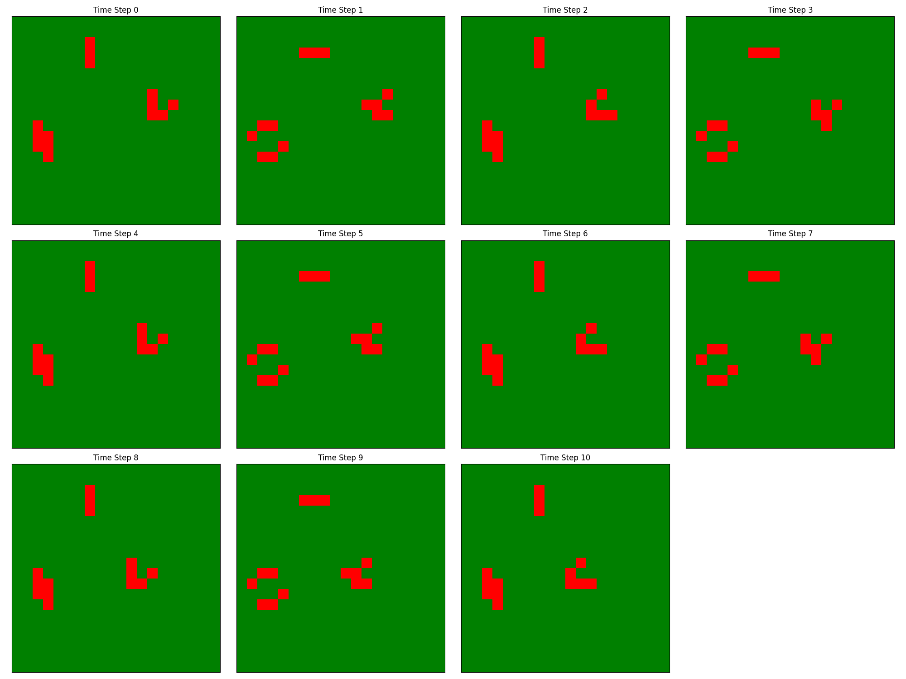

# Game of Life

Conway's Game of Life implemented on a GeoDataFrame grid.




## Usage

```python
from dissmodel.core import Environment
from dissmodel.geo import regular_grid
from dissmodel.models.ca import GameOfLife

from matplotlib.colors import ListedColormap
from dissmodel.visualization.map import Map

gdf = regular_grid(dimension=(30, 30), resolution=1)
env = Environment(end_time=20)
model = GameOfLife(gdf=gdf)
model.initialize()

cmap = ListedColormap(["white", "black"])
Map(
    gdf=gdf,
    plot_params={"column": "state", "cmap": cmap, "ec": "gray"},
)

env.run()
```

## API Reference

::: dissmodel.models.ca.game_of_life.GameOfLife
